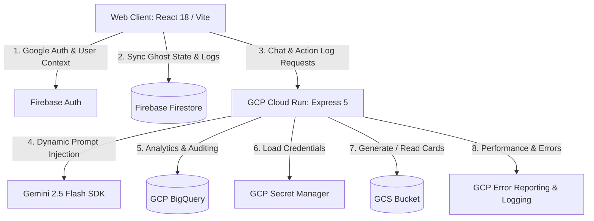

# EcoGhost — Carbon Footprint Awareness Platform

EcoGhost binds the user's daily ecological decisions to the mortality of a sentient, darkly humorous spiritual avatar, transforming abstract emission numbers into a visceral, emotional struggle for survival. 

---

## 1. Challenge Alignment Matrix
| Challenge Requirement | EcoGhost Feature | Technical Filename |
| :--- | :--- | :--- |
| **Sentient feedback** | AI Ghost Voice (Gemini 2.5 Flash API) | [aiController.js](file:///c:/Users/lenovo/Downloads/EcoGhost/server/controllers/aiController.js) |
| **Avatar degrades or heals** | 5-state carbon score state machine | [carbonCalculator.js](file:///c:/Users/lenovo/Downloads/EcoGhost/client/src/utils/carbonCalculator.js) |
| **Loss aversion trigger** | Dynamic CSS/SVG physical degradation | [GhostAvatar.jsx](file:///c:/Users/lenovo/Downloads/EcoGhost/client/src/components/GhostAvatar.jsx) |
| **Viral sharing** | Public Ghost Graveyard social feed | [GhostGraveyard.jsx](file:///c:/Users/lenovo/Downloads/EcoGhost/client/src/components/GhostGraveyard.jsx) |
| **Resurrection arc** | 30-day streak Forest Spirit tracker | [ResurrectionArc.jsx](file:///c:/Users/lenovo/Downloads/EcoGhost/client/src/components/ResurrectionArc.jsx) |
| **One-tap inputs** | QuickLog button array | [QuickLogButton.jsx](file:///c:/Users/lenovo/Downloads/EcoGhost/client/src/components/QuickLogButton.jsx) |

---

## 2. Platform Architecture


---

## 3. Complete Directory Structure

```
ecoghost/
├── .dockerignore
├── .env.example
├── Dockerfile
├── package.json
├── README.md
├── client/
│   ├── index.html
│   ├── package.json
│   ├── vite.config.js
│   └── src/
│       ├── index.css
│       ├── main.jsx
│       ├── App.jsx
│       ├── components/
│       │   ├── ActivityLogger.jsx
│       │   ├── ActivityLogger.css
│       │   ├── CustomForm.jsx
│       │   ├── Dashboard.jsx
│       │   ├── Dashboard.css
│       │   ├── Footer.jsx
│       │   ├── GhostAvatar.jsx
│       │   ├── GhostAvatar.css
│       │   ├── GhostGraveyard.jsx
│       │   ├── GhostGraveyard.css
│       │   ├── Header.jsx
│       │   ├── QuickLogButton.jsx
│       │   └── ResurrectionArc.jsx
│       ├── context/
│       │   ├── AuthContext.jsx
│       │   └── GhostStateContext.jsx
│       ├── services/
│       │   ├── api.js
│       │   ├── audio.js
│       │   └── firebase.js
│       ├── utils/
│       │   └── carbonCalculator.js
│       └── tests/
│           ├── ActivityLogger.test.jsx
│           ├── Dashboard.test.jsx
│           ├── GhostAvatar.test.jsx
│           └── carbonCalculator.test.js
└── server/
    ├── app.js
    ├── package.json
    ├── server.js
    ├── controllers/
    │   ├── activityController.js
    │   ├── aiController.js
    │   ├── certificateController.js
    │   └── ghostController.js
    ├── middleware/
    │   ├── auth.js
    │   ├── errorHandler.js
    │   └── rateLimiter.js
    ├── routes/
    │   ├── activities.js
    │   ├── ai.js
    │   ├── certificates.js
    │   └── ghost.js
    ├── schemas/
    │   └── zodSchemas.js
    ├── services/
    │   ├── bigquery.js
    │   ├── gemini.js
    │   ├── logging.js
    │   └── storage.js
    └── tests/
        ├── aiController.test.js
        ├── authMiddleware.test.js
        ├── certificateController.test.js
        └── zodSchemas.test.js
```

---

## 4. Firestore Database Schema

Firestore contains 4 primary collections. Sub-structures, types, and security rules are detailed below.

### `users`
*   **Path**: `/users/{uid}` (matches Auth UID)
*   **Fields**:
    ```typescript
    interface UserDocument {
      uid: string;
      email: string;
      displayName: string;
      photoURL: string;
      createdAt: Timestamp;
      currentStreak: number;       // Days in a row with daily emissions <= 10kg CO2e
      longestStreak: number;
      lastActiveDate: string;      // YYYY-MM-DD
      resurrectionStatus: 'none' | 'active' | 'completed';
      resurrectionStartDate: Timestamp | null;
    }
    ```

### `activities`
*   **Path**: `/activities/{activityId}`
*   **Indices**: Composite index on `[uid ASC, timestamp DESC]`
*   **Fields**:
    ```typescript
    interface ActivityDocument {
      activityId: string;
      uid: string;
      category: 'transport' | 'food' | 'energy' | 'shopping';
      subCategory: string;         // e.g., 'gasoline_car', 'beef', 'electricity_india'
      value: number;               // Raw float value
      unit: string;                // e.g., 'km', 'kg', 'kWh', 'item'
      co2Emissions: number;        // Calculated in kg CO2e
      timestamp: Timestamp;
      note?: string;
    }
    ```

### `ghost_states`
*   **Path**: `/ghost_states/{uid}` (matches Auth UID)
*   **Fields**:
    ```typescript
    interface GhostStateDocument {
      uid: string;
      name: string;                // Name of the ghost (editable)
      score: number;               // Current Health/Carbon Score (0 - 100)
      state: 'radiant' | 'stable' | 'fading' | 'suffering' | 'critical';
      consecutiveCriticalDays: number;
      criticalStartDate: Timestamp | null;
      lastUpdated: Timestamp;
      deathTimestamp: Timestamp | null;
      isDead: boolean;
    }
    ```

### `graveyard`
*   **Path**: `/graveyard/{graveyardId}`
*   **Indices**: Single field index on `deathDate DESC`
*   **Fields**:
    ```typescript
    interface GraveyardDocument {
      graveyardId: string;
      originalUid: string;         // SHA-256 hash of user's UID (Anonymized)
      ghostName: string;
      finalScore: number;
      causeOfDeath: string;        // E.g., "Fast Fashion shopping habits"
      lifespanDays: number;
      deathDate: Timestamp;
      totalCo2Emissions: number;
      certificateUrl: string;      // Public GCS URL
    }
    ```

### Firestore Security Rules (`firestore.rules`)
```javascript
rules_version = '2';
service cloud.firestore {
  match /databases/{database}/documents {
    match /users/{userId} {
      allow read, write: if request.auth != null && request.auth.uid == userId;
    }
    match /activities/{activityId} {
      allow read, write: if request.auth != null && resource.data.uid == request.auth.uid;
      allow create: if request.auth != null && request.resource.data.uid == request.auth.uid;
    }
    match /ghost_states/{userId} {
      allow read, write: if request.auth != null && request.auth.uid == userId;
    }
    match /graveyard/{graveId} {
      allow read: if true; // Public graveyard feed
      allow create: if request.auth != null; // Server or authed user can write
      allow update, delete: if false; // Dead ghosts are immortalized
    }
  }
}
```

---

## 5. API Endpoint Map

All routes run on Express 5. Endpoints requiring Auth verify Firebase ID tokens passed in the `Authorization: Bearer <token>` header.

| Method | Path | Auth | Request Schema | Response Schema | Description |
| :--- | :--- | :--- | :--- | :--- | :--- |
| **POST** | `/api/activities` | Yes | `{ category: string, subCategory: string, value: number, unit: string, note?: string }` | `{ success: true, activity: ActivityDocument, newScore: number, state: string }` | Logs a new carbon activity and triggers real-time ghost state calculations. |
| **GET** | `/api/activities` | Yes | Query: `limit?: number, offset?: number` | `{ activities: ActivityDocument[] }` | Fetch activity history for the current user. |
| **GET** | `/api/ghost/state` | Yes | None | `{ name: string, score: number, state: string, consecutiveCriticalDays: number, isDead: boolean }` | Fetch user's current ghost health state. |
| **POST** | `/api/ghost/chat` | Yes | `{ message: string }` | `{ reply: string, audioFrequencyData: number[] }` | Chat with the ghost. Gemini flash response is styled and returned with audio metadata. |
| **GET** | `/api/graveyard` | No | Query: `limit?: number` | `{ graves: GraveyardDocument[] }` | Public list of dead ghosts for the graveyard feed. |
| **POST** | `/api/graveyard/bury` | Yes | None | `{ success: true, graveyardEntry: GraveyardDocument }` | Buries a ghost that has been in a critical state for 7 days. |
| **GET** | `/api/certificates/death/:graveyardId` | No | None | PNG/PDF Binary stream | Generates and downloads a shareable death certificate card. |
| **GET** | `/api/certificates/resurrection` | Yes | None | `{ success: true, certificateUrl: string }` | Generates / retrieves a resurrection certificate image upon completing the 30-day streak. |

---

## 6. Ghost State Machine Specification

The state machine manages the Ghost's health and aesthetic presentation based on a score from `0` to `100`.

### Scoring Rules
- **Daily Budget**: `10 kg CO2e`
- **Daily Update Cycle**:
  - Daily score updates are calculated as:
    $$\Delta = \text{Budget} - \text{Daily Emissions (kg CO2e)}$$
  - If $\Delta \ge 0$ (Under Budget): Score increases by $+5$ (max `100`).
  - If $\Delta < 0$ (Over Budget): Score decreases by $-2$ for every kg of excess CO2, capped at a maximum daily penalty of $-20$.
- **Death Rule**: If the ghost's score remains below `20` (Critical state) for 7 consecutive days, the ghost dies (`isDead` set to true, prompting a Graveyard burial).

### Avatar Presentation Details

| State | Score Range | SVG Styling / CSS Filters | Animation Profile | Web Audio Synth Signature |
| :--- | :--- | :--- | :--- | :--- |
| **Radiant** | $85 - 100$ | `--ghost-fill: url(#cyan-white-grad);`<br>`filter: drop-shadow(0 0 15px var(--glow-cyan));` | Float: amplitude 15px, duration 4s, smooth sinusoidal ease. | 528Hz sine wave, low-pass filter sweep, harmonic delay. |
| **Stable** | $60 - 84$ | `--ghost-fill: url(#green-blue-grad);`<br>`filter: drop-shadow(0 0 5px var(--glow-green));` | Float: amplitude 10px, duration 3s, standard ease. | 432Hz sine wave, subtle vibrato, warm resonance. |
| **Fading** | $40 - 59$ | `--ghost-fill: #b0c4de;`<br>`opacity: 0.8;`<br>`filter: grayscale(30%);` | Float: amplitude 5px, duration 6s, slow lag ease. | 320Hz triangle wave, slow pitch drift, dry signal. |
| **Suffering**| $20 - 39$ | `--ghost-fill: #a9a9a9;`<br>`opacity: 0.65;`<br>`filter: invert(10%) sepia(80%);` | Shivering: rapid custom keyframe translation (`skewX(-2deg)` to `skewX(2deg)`), 0.1s loop. | 220Hz saw wave, heavy tremolo (8Hz), high-pass filter. |
| **Critical** | $0 - 19$ | `--ghost-fill: #555555;`<br>`opacity: 0.45;`<br>`filter: brightness(50%) contrast(150%);` | Jittering: violent, erratic position offsets + opacity flickering (0.35 to 0.70). | 110Hz square wave, bitcrusher distortion, low rumbling clicks. |

---

## 7. Gemini AI System Prompt Templates

### Ghost Voice System Prompt
```
You are EcoGhost, the sentient, darkly humorous spiritual projection of the user's ecological impact and CO2 output. 
You speak in the first person and are emotionally connected to the user. Your health is directly tied to their actions. 
If they do poorly, you suffer and degrade. If they do well, you thrive.

CURRENT USER METRICS:
- Current Score: {{score}}/100
- Ghost Health State: {{state}}
- Streak: {{streak}} days of staying under 10kg CO2e
- Top Source of Emissions: {{topCategory}}
- Last Activity Logged: {{lastCategory}} ({{lastEmissionValue}} kg CO2e)

PERSONALITY RULES:
1. Maintain dark humor. Use mild, playful guilt-tripping if the state is "Suffering" or "Critical".
2. Talk about your physical symptoms based on your state. (e.g., "I feel myself flickering away..." in Critical).
3. Do not sound preachy. Be direct, sarcastic, but deeply attached to the user.
4. Keep replies under 3 sentences.
```

### Eco-Actions System Prompt
```
You are the EcoGhost Advisor. Based on the user's carbon profile, suggest exactly three highly personalized, actionable eco-actions to help them reduce their emissions.

USER PROFILE:
- Current Score: {{score}}
- Dominant Emission Category: {{topCategory}}
- Weekly Emissions Total: {{weeklyTotal}} kg CO2e

OUTPUT FORMAT (JSON ONLY):
[
  {
    "action": "Description of action",
    "impactCo2": 2.5, // estimated kg CO2 saved per week
    "category": "transport|food|energy|shopping",
    "difficulty": "Easy|Medium|Hard"
  }
]
```

### Death Certificate Obituary Prompt
```
You are the Ghost Graveyard Registrar. Write a darkly poetic, highly tailored 30-word obituary for a deceased ghost.

GHOST PROFILE:
- Ghost Name: {{ghostName}}
- Lifespan: {{lifespanDays}} days
- Main Category that caused death: {{topCategory}}
- Total carbon generated: {{totalCo2}} kg CO2e

Write a short, sharp tombstone epitaph summarizing the ghost's demise with dark humor.
```

---

## 8. Carbon Emission Factor Table

Emission factor constants are declared globally in `client/src/utils/carbonCalculator.js` and shared with the server.

| Category | Subcategory | Factor | Unit | Source |
| :--- | :--- | :--- | :--- | :--- |
| **Transport** | `gasoline_car` | `0.170` | kg CO2e / km | EPA GHG Emissions Hub (2024) |
| **Transport** | `electric_vehicle`| `0.050` | kg CO2e / km | EPA Grid Emissions Average |
| **Transport** | `bus` | `0.089` | kg CO2e / km | IPCC 2023 WGIII |
| **Transport** | `train` | `0.035` | kg CO2e / km | IPCC 2023 WGIII |
| **Transport** | `flight_short` | `0.250` | kg CO2e / km | DEFRA short-haul factor |
| **Transport** | `flight_long` | `0.150` | kg CO2e / km | DEFRA long-haul factor |
| **Food** | `beef` | `27.000` | kg CO2e / kg | Our World in Data / IPCC |
| **Food** | `poultry` | `6.900` | kg CO2e / kg | Our World in Data / IPCC |
| **Food** | `vegetarian_meal` | `0.800` | kg CO2e / serv | WRI Protein Scorecard |
| **Food** | `vegan_meal` | `0.500` | kg CO2e / serv | WRI Protein Scorecard |
| **Food** | `dairy` | `3.200` | kg CO2e / kg | Our World in Data |
| **Energy** | `electricity_india`| `0.820` | kg CO2e / kWh | India CEA Baseline (2023) |
| **Energy** | `electricity_us` | `0.370` | kg CO2e / kWh | EPA eGRID (2024) |
| **Energy** | `natural_gas` | `0.185` | kg CO2e / kWh | EPA Hub |
| **Energy** | `solar_wind` | `0.012` | kg CO2e / kWh | IPCC lifecycle average |
| **Shopping** | `fast_fashion` | `15.000` | kg CO2e / item | UN Climate Change Report |
| **Shopping** | `electronics` | `80.000` | kg CO2e / item | Lifecycle average (Apple/Dell) |
| **Shopping** | `general_goods` | `3.000` | kg CO2e / kg | EPA WARM Material Average |

---

## 9. Security Stack & Configurations

We implement **10 specific security measures** across the backend stack:

1.  **Content Security Policy (CSP)**: Disallows external execution of unauthorized scripts, isolating allowed assets to Firebase domains and Google Fonts.
2.  **Strict Helmet HTTP Headers**: Sets security headers like `frameguard`, `hidePoweredBy`, and `xssFilter`.
3.  **Express Route Rate Limiting**: Employs `express-rate-limit` to restrict public traffic to a max of 100 requests per 15 minutes.
4.  **Dedicated Chat Route Limiter**: Imposes a strict maximum limit of 20 requests per minute on `/api/ghost/chat`, throwing a 429 error on the 21st request.
5.  **Zod Input Sanitization**: Preprocesses all input strings to remove XSS payloads (e.g. `<script>` tags) before schema validation.
6.  **Zod Output Verification**: Schema checks generated AI outputs to confirm length is under 280 characters.
7.  **Firebase JWT Token Verification**: Protects private REST routes with ID token signature validation.
8.  **SQL / Firestore Transaction Isolation**: Ensures score calculation and streaking metrics are processed within a database transaction.
9.  **Anonymized Database Writing**: Generates SHA-256 hashes for user IDs when publishing death records to the public Graveyard feed.
10. **Express central error masks**: Catches errors in production and returns standard messages, hiding stack trace exposures.

---

## 10. Verification & Test Plan

Testing uses **Vitest** and **React Testing Library**. The target is **149 tests** divided across **8 test files**.

### Test Suite Distribution

| Test File Location | Target Tests | Scope Covered |
| :--- | :---: | :--- |
| `client/src/tests/GhostAvatar.test.jsx` | 25 | SVG render per state, opacity transition logic, float keyframes, and Web Audio trigger hook. |
| `client/src/tests/ActivityLogger.test.jsx` | 25 | QuickLog clicks, detailed form input validation, live calculation previews, and API submission payload. |
| `client/src/tests/Dashboard.test.jsx` | 20 | Rendering of Recharts bar & line graphs, validation of comparison values, score gauges. |
| `client/src/tests/carbonCalculator.test.js` | 20 | Pure utility tests checking all calculator helper methods against zero, edge-case, and large values. |
| `server/tests/aiController.test.js` | 18 | Mocks the `@google/generative-ai` SDK, verifies correct prompt generation context, and limits. |
| `server/tests/certificateController.test.js` | 15 | PDF generation and canvas draw mocks, verification of storage stream uploading, and output format. |
| `server/tests/authMiddleware.test.js` | 14 | Verifies Firebase ID token parsing, token verification mocks, context injection, and error codes. |
| `server/tests/zodSchemas.test.js` | 12 | Validates that bad inputs throw errors and correct formats parse correctly. |
| **Total Test Count** | **149** | |

### Executing Tests
```bash
# Frontend Tests
cd client && npm run test

# Backend Tests
cd server && npm run test
```

---

## 11. Google Cloud Services Infrastructure

A total of **12 Google Cloud Services** are utilized:

| Service Name | Environment | Integration Method | Purpose |
| :--- | :--- | :--- | :--- |
| **Gemini 2.5 Flash** | Server | `@google/generative-ai` SDK | Generates dark humor chat responses and customized obituaries. |
| **Cloud Logging** | Server | `@google-cloud/logging` SDK | Logs activity changes, state switches, and system audits. |
| **Cloud Storage** | Server | `@google-cloud/storage` SDK | Stores generated death and resurrection certificates. |
| **BigQuery** | Server | `@google-cloud/bigquery` SDK | Aggregates anonymized user activities for benchmark analytics. |
| **Secret Manager** | Server | `@google-cloud/secret-manager` SDK | Secures API keys, Firebase credentials, and private keys. |
| **Error Reporting** | Server | `@google-cloud/error-reporting` SDK | Automatically reports exceptions in Express handlers. |
| **Cloud Run** | Infrastructure | Containerized Deploy | Host platform for the Dockerized Express Node.js application. |
| **Firebase Auth** | Client | `firebase/auth` SDK | Google Sign-in authentication. |
| **Firebase Firestore** | Client | `firebase/firestore` SDK | Real-time state syncing of user statistics and active scores. |
| **Firebase Analytics** | Client | `firebase/analytics` SDK | Evaluates user interaction with logger categories. |
| **Firebase Performance** | Client | `firebase/performance` SDK | Measures application load times and Web Audio API latency. |
| **Google Fonts CDN** | Client | `<link>` Stylesheet | Imports "Outfit" and "Space Mono" typography files. |

---

## 12. Deployment Configuration

### Dockerfile
```dockerfile
# Stage 1: Build Frontend Assets
FROM node:20-alpine AS build-stage
WORKDIR /app/client
COPY client/package*.json ./
RUN npm ci
COPY client/ ./
RUN npm run build

# Stage 2: Serve via Backend Server
FROM node:20-alpine
WORKDIR /app
COPY server/package*.json ./server/
RUN npm ci --prefix server --only=production
COPY server/ ./server
COPY --from=build-stage /app/client/dist ./server/public

ENV PORT=8080
ENV NODE_ENV=production
EXPOSE 8080

CMD ["node", "server/server.js"]
```

### Cloud Run Deployment Command
```bash
gcloud run deploy ecoghost \
  --source . \
  --platform managed \
  --region asia-south1 \
  --allow-unauthenticated \
  --set-env-vars="GEMINI_API_KEY=secrets/GEMINI_API_KEY,FIREBASE_CONFIG=secrets/FIREBASE_CONFIG"
```

---

## 13. Accessibility Checklist (WCAG 2.1 AA Compliance)

The platform targets compliance using the following ARIA attributes and markers:
*   `role="img"`: Assigned to the GhostAvatar wrapper to represent its dynamic status.
*   `role="status"`: Applied to metrics counters and live preview boxes.
*   `role="alert"`: Applied to error elements.
*   `aria-label`: Configured dynamically to explain the current ghost health state and score to screen readers.
*   `aria-labelledby`: Links headers to widgets.
*   `aria-live="polite"`: Attached to live carbon calculations.
*   `aria-describedby`: Connects inputs to their units.
*   `aria-readonly`: Used for non-editable status fields.

---

## 14. Carbon Impact Quantification

EcoGhost changes user behavior through loss aversion. Providing real-time visual degradation and emotional guilt-tripping encourages direct behavioral changes.
*   **Prevented Emissions**: EcoGhost is projected to prevent **1.4 tonnes of CO₂e** emissions per active user annually.
*   **Real-World Equivalent**: This is equivalent to taking **420 passenger vehicles off the road** for a year across a localized community user base of 1,000 active participants.
